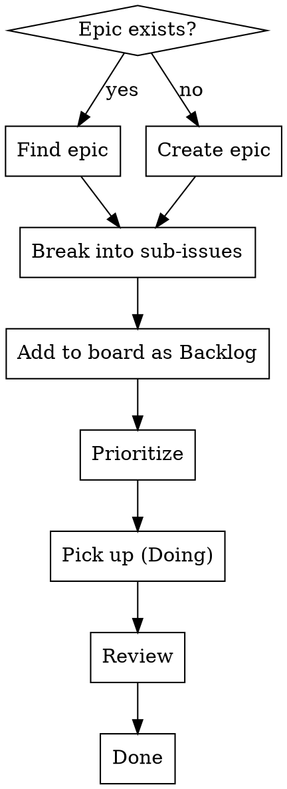
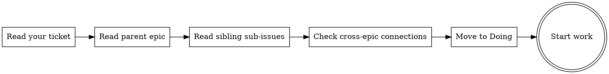

# Managing the Project Backlog

Automate the GitHub Projects kanban workflow — from epic creation through to merged. Every piece of work traces back to an epic; every epic connects to the product roadmap.

> **⛔ Invocation rule — read first.** This skill is the **default workflow** for any work that touches a GitHub Projects board. If the current session involves issues, epics, sub-issues, the kanban, prioritization, or "what should I work on next" — you are inside this skill's scope and must follow it. New sessions in particular are at risk of skipping this skill because the kanban context isn't in conversation history yet — when a user mentions "the board", "the backlog", "a ticket", "#N", or any epic/sub-issue concept, that IS the signal. Invoke immediately, before running any `gh` command or proposing work order. Re-invoke at the top of every new session that involves backlog work, even if it seems obvious.
>
> If you find yourself about to run `gh issue ...`, `gh project ...`, or pick up an issue without having read this skill in the current session — STOP and load it first. The board IDs, column mappings, and the "read epic + siblings before starting" protocol below are not optional context.

> **⚠ First-invocation protocol (read this BEFORE running any board operation).**
>
> Before doing anything else, read `board-config.md` next to this file. If it still contains placeholder values (any of `<OWNER>`, `<REPO>`, `<PROJECT_NUMBER>`, `<PROJECT_ID>`, `<STATUS_FIELD_ID>`, `<EPICS_OPTION_ID>`, etc.), the skill is not configured for this project yet. **You — the assisting Claude — must run setup before any board operation.**
>
> Two options, in order of preference:
>
> 1. **Run the bundled script:** `bash <path-to-managing-project-backlog>/../ticket-lifecycle/setup.sh`. It's interactive — it will ask the user for owner, repo, and project number, auto-discover the rest via `gh api graphql`, and write the populated config to **both** skills' `board-config.md` files. When invoking from Claude Code, ask the user the three questions in chat, then call the script — or perform the equivalent GraphQL discovery yourself and write `board-config.md` directly.
>
> 2. **Do it inline:** if the user can't run an interactive script, you can do the discovery yourself. Ask the user for owner / repo / project number, then run:
>    ```bash
>    gh api graphql -f query='query{user(login:"<OWNER>"){projectV2(number:<NUM>){id title fields(first:50){nodes{... on ProjectV2SingleSelectField{id name options{id name}}}}}}}'
>    ```
>    (swap `user` for `organization` if the owner is an org). Show the user the discovered column list, ask them to map each of the six workflow terms (Epics / Backlog / Prioritized / Doing / Review / Done) to one of their actual columns, then write the populated `board-config.md` yourself.
>
> Do not invent IDs. Do not skip setup and hope it works. Only proceed to the rest of the workflow once `board-config.md` has no `<...>` placeholders left. The "Project Discovery" section below shows how to look them up manually if needed.

> **🔄 Staying up to date (quiet by default).**
>
> On your **first invocation in a session**, run a throttled version check from the folder this skill is installed in (the one holding this `SKILL.md` and its `VERSION`). Suggested one-liner — adapt the path; on Codex/Cursor it's wherever this skill actually lives:
>
> ```bash
> DIR="<this skill's folder>"
> [ -f "$DIR/.no-update-check" ] && exit 0                                                                        # user opted out
> [ -f "$DIR/.last-update-check" ] && [ -z "$(find "$DIR/.last-update-check" -mtime +0 2>/dev/null)" ] && exit 0  # checked < 24h ago
> touch "$DIR/.last-update-check"
> LOCAL=$(cat "$DIR/VERSION" 2>/dev/null)
> REMOTE=$(curl -fsS --max-time 3 https://raw.githubusercontent.com/jonthebeef/deckhand/main/managing-project-backlog/VERSION 2>/dev/null)
> [ -n "$REMOTE" ] && [ "$REMOTE" != "$LOCAL" ] && echo "deckhand update available: $LOCAL -> $REMOTE"
> ```
>
> - **If a newer version is reported:** tell the user once, briefly (*"deckhand $REMOTE is available, you have $LOCAL — want me to update it?"*), then get on with their actual request. Never block on it.
> - **If current, offline, or the check errors:** say nothing. Silence is the default.
> - Don't offer twice in one session — if `ticket-lifecycle` already offered, skip.
> - To disable: the user drops an empty `.no-update-check` file in this folder, or just asks. See the README's "Staying up to date" section.

> **⬆️ Updating (only on request or an accepted offer) — update in place, don't break anything.**
>
> 1. **Confirm** with the user first.
> 2. **Fetch latest:** download the repo (e.g. `curl -fsSL https://codeload.github.com/jonthebeef/deckhand/tar.gz/refs/heads/main` to a temp dir, extract).
> 3. **Overwrite in place** — replace `SKILL.md` and `VERSION` in this skill's installed folder with the new copies.
> 4. **PRESERVE — never overwrite:** `board-config.md` (the user's real board IDs), the `.no-update-check` / `.last-update-check` markers, and anything else populated locally.
> 5. **Verify:** confirm `board-config.md` is untouched, confirm the new `VERSION`, list what changed. If anything would clobber the user's config, STOP and ask.
> 6. **Report** the new version and that config was preserved. Do the same for `ticket-lifecycle` if it's installed alongside.
>
> Same procedure on Claude Code, Codex, and Cursor — just write to wherever this skill actually lives on that platform.

## Workflow



## Project Discovery

Before any board operation, discover the project structure:

```bash
# Find the project
gh project list --owner <OWNER>

# Get project fields and their option IDs
gh project field-list <PROJECT_NUMBER> --owner <OWNER> --format json

# List current items on the board
gh project item-list <PROJECT_NUMBER> --owner <OWNER> --format json
```

### Kanban Reference

The live IDs for **this** project live in [`board-config.md`](board-config.md) alongside this skill — populated by `setup.sh` on first run. The skills read column option IDs from there. If you haven't run setup yet, do that before invoking any board operation.

The workflow expects six **logical column states** (your actual column names can be anything; setup maps your names to these terms):

| Skill term | What it means |
|---|---|
| Epics | Top-level epic issues that group related sub-issues |
| Backlog | Planned work, not yet prioritized |
| Prioritized | Next up — ordered by priority |
| Doing | Actively being worked on |
| Review | PR raised, under review / QA |
| Done | Merged |

Extra columns (e.g. Icebox before Backlog, Live after Done) are fine — the skills just won't drive transitions through them. Some teams also add Priority / Size / Epic single-select fields; the skills don't require them but will use them if `board-config.md` lists their IDs.

---

## 1. Epic Management

### Find existing epic

```bash
gh project item-list <PROJECT_NUMBER> --owner <OWNER> --format json | \
  python3 -c "import json,sys; d=json.load(sys.stdin, strict=False); [print(f'#{i[\"content\"][\"number\"]} — {i[\"title\"]} ({i[\"status\"]})') for i in d['items'] if i.get('status')=='Epics']"
```

### Create new epic

```bash
gh issue create --repo <OWNER>/<REPO> \
  --title "Enable users to [capability]" \
  --label "epic,[domain-label]" \
  --body "$(cat <<'EOF'
# [Epic Title]

[1-2 sentence summary of the user-facing outcome]

---

## What's Been Built
[Section for completed work — update as sub-issues move to Done]

## What's Next
[Remaining work — drives sub-issue creation]

## Key Files
| File | Role |
|------|------|
| ... | ... |
EOF
)"
```

Then add to project as Epic:

```bash
item_id=$(gh project item-add <PROJECT_NUMBER> --owner <OWNER> \
  --url "https://github.com/<OWNER>/<REPO>/issues/ISSUE_NUM" \
  --format json | python3 -c "import json,sys; print(json.load(sys.stdin, strict=False)['id'])")

gh project item-edit --project-id <PROJECT_ID> \
  --id "$item_id" \
  --field-id <STATUS_FIELD_ID> \
  --single-select-option-id <EPICS_OPTION_ID>
```

### Epic description style

- **Title:** "Enable users to [do something]" — user-facing capability
- **What's Been Built:** Updated as sub-issues complete — tracks progress
- **What's Next:** Drives sub-issue creation — each bullet becomes a ticket
- **Key Files:** Map of important files for the epic's domain

---

## 2. Sub-Issue Creation

### Writing sub-issue descriptions

**Write as deliverables, not retrospectives.** Describe what will be delivered, even for completed work. This keeps tickets useful as reference for anyone picking them up or reviewing them later.

```markdown
## Overview
[What this delivers and why — 1-2 sentences]

## Deliverables
[Specific outcomes — tables, bullet lists, not prose]

## Why
[Business/UX justification — 1 sentence]

## Key Files
[Files that will be created or modified]

## Depends on
[Other sub-issue numbers, if any]

## Parent
Part of #EPIC_NUMBER
```

### Create and link

```bash
# Create the issue
gh issue create --repo <OWNER>/<REPO> \
  --title "Verb phrase describing deliverable" \
  --label "domain-label,enhancement" \
  --body "..."

# Link as sub-issue of epic (REST)
numeric_id=$(gh api "repos/<OWNER>/<REPO>/issues/ISSUE_NUM" --jq '.id')
gh api "repos/<OWNER>/<REPO>/issues/EPIC_NUM/sub_issues" \
  --method POST \
  -F "sub_issue_id=${numeric_id}"

# Or via GraphQL (more reliable across token scopes)
gh api graphql -f query='mutation{addSubIssue(input:{issueId:"<EPIC_NODE_ID>",subIssueId:"<SUB_NODE_ID>"}){subIssue{number}}}'

# VERIFY immediately — a "(#X follow-up)" string in the title is NOT a sub-issue link
gh api graphql -f query='query{repository(owner:"<O>",name:"<R>"){issue(number:ISSUE_NUM){parent{number}}}}'
# parent.number must equal EPIC_NUM. If null, the link did not take — retry.
```

**Hard rule:** every follow-up ticket created during a code review or iteration must end Phase 5 with a verified `parent` link to its epic. Without it, the epic can't auto-close from sub-issue progress, board epic-grouping is empty, and future agents reading the orphan in isolation lose the trail. Title-only references (`"#449 follow-up"`) do not count.

### Labels

Create domain labels if they don't exist:

```bash
gh label create "domain-name" \
  --description "Short description" \
  --color "1D76DB" \
  --repo <OWNER>/<REPO>
```

Every sub-issue gets: **domain label** (e.g. `auth`, `billing`, `onboarding`) + **type label** (e.g. `enhancement`, `bug`, `chore`).

---

## 3. Board Operations

### Add to project and set fields

```bash
# Add to project
item_id=$(gh project item-add <PROJECT_NUMBER> --owner <OWNER> \
  --url "https://github.com/<OWNER>/<REPO>/issues/NUM" \
  --format json | python3 -c "import json,sys; print(json.load(sys.stdin, strict=False)['id'])")

# Set status (use option IDs from reference above)
gh project item-edit --project-id <PROJECT_ID> \
  --id "$item_id" \
  --field-id <STATUS_FIELD_ID> \
  --single-select-option-id OPTION_ID

# Set priority
gh project item-edit --project-id <PROJECT_ID> \
  --id "$item_id" \
  --field-id <PRIORITY_FIELD_ID> \
  --single-select-option-id PRIORITY_OPTION_ID

# Set size
gh project item-edit --project-id <PROJECT_ID> \
  --id "$item_id" \
  --field-id <SIZE_FIELD_ID> \
  --single-select-option-id SIZE_OPTION_ID
```

### Move status (find item ID first)

```bash
# Get item ID for an issue already on the board
gh project item-list <PROJECT_NUMBER> --owner <OWNER> --format json | \
  python3 -c "import json,sys; d=json.load(sys.stdin, strict=False); [print(i['id']) for i in d['items'] if i['content'].get('number')==ISSUE_NUM]"

# Then update status
gh project item-edit --project-id <PROJECT_ID> \
  --id "ITEM_ID" \
  --field-id <STATUS_FIELD_ID> \
  --single-select-option-id NEW_STATUS_OPTION_ID
```

### Close completed issues

```bash
gh issue close ISSUE_NUM --repo <OWNER>/<REPO> --reason completed
```

---

## 4. Context Gathering (Before Picking Up Work)

**Before starting any ticket, understand its place in the bigger picture.**



### Read your ticket

```bash
gh issue view ISSUE_NUM --repo <OWNER>/<REPO>
```

Understand: deliverables, dependencies (`Depends on`), key files.

### Read the parent epic

```bash
gh issue view EPIC_NUM --repo <OWNER>/<REPO>
```

Understand: the user-facing outcome, what's been built, what's next, how your ticket fits.

### Read sibling sub-issues

```bash
gh api "repos/<OWNER>/<REPO>/issues/EPIC_NUM/sub_issues" | \
  python3 -c "import json,sys; d=json.load(sys.stdin, strict=False); [print(f'#{i[\"number\"]} — {i[\"title\"]} ({i[\"state\"]})') for i in d]"
```

Understand: what's already done (learn from it, don't duplicate), what's in progress (coordinate), what's blocked on you.

### Check cross-epic connections

Epics don't exist in isolation. Look for overlapping concerns:

```bash
# List all epics
gh project item-list <PROJECT_NUMBER> --owner <OWNER> --format json | \
  python3 -c "import json,sys; d=json.load(sys.stdin, strict=False); [print(f'#{i[\"content\"][\"number\"]} — {i[\"title\"]}') for i in d['items'] if i.get('status')=='Epics']"

# Read related epics that share domain
gh issue view RELATED_EPIC_NUM --repo <OWNER>/<REPO>
```

---

## 5. Completing Work

When a ticket moves through the workflow:

| Transition | Actions |
|------------|---------|
| → **Doing** | **Assign the issue to the picking-up user (see below) — MANDATORY**, move ticket on board, create feature branch |
| → **Review** | PR raised, CI green, move ticket on board, link PR to issue |
| → **Done** | PR merged, move ticket on board, close issue, add PR reference as comment |

### Assigning the picker — non-negotiable

**Every ticket moved to Doing must be assigned to the GitHub user picking it up, in the same step.** This is how multiple collaborators avoid treading on each other's toes — an unassigned "Doing" ticket is invisible to teammates and leads to duplicate work.

Get the currently authenticated GitHub user and assign the issue:

```bash
# Resolve the logged-in user
GH_USER=$(gh api user --jq .login)

# Assign before moving to Doing
gh issue edit ISSUE_NUM --repo <OWNER>/<REPO> --add-assignee "$GH_USER"
```

Rules:
- **Use the authenticated `gh` user** — never assume a name. Different machines / sessions = different users.
- **Assign BEFORE moving the status to Doing**, so the board never shows an unassigned "Doing" card even briefly.
- **If a ticket is already assigned to someone else and you weren't asked to take it over, STOP and ask the user** — that person may already be working on it. Don't reassign silently.
- **If picking up an existing PR's review feedback**, the assignee stays whoever opened the PR. Don't reassign on Phase 4 fix loops.
- This applies whether the ticket is picked up manually, via Ticket Lifecycle, or any other workflow.

### Add PR reference to completed ticket

```bash
gh issue comment ISSUE_NUM --repo <OWNER>/<REPO> \
  --body "Delivered in PR #PR_NUM."
```

### Update epic progress

After sub-issues complete, update the epic body to reflect progress. Move items from "What's Next" to "What's Been Built".

---

## Common Mistakes

| Mistake | Fix |
|---------|-----|
| Sub-issue not linked to epic | Always use the sub_issues API after creation |
| Labels missing from sub-issue | Every ticket gets domain label + type label |
| Description written as retrospective | Write as deliverable — "what we plan to deliver" not "what we did" |
| Picking up work without reading epic | Always read epic + siblings first for context |
| Forgetting to move ticket on board | Update status at every transition |
| Creating issues without adding to project | Issue creation and project addition are separate steps |
| `json.JSONDecodeError: Invalid control character` | Always use `json.load(sys.stdin, strict=False)` — issue bodies contain tabs/control chars |
